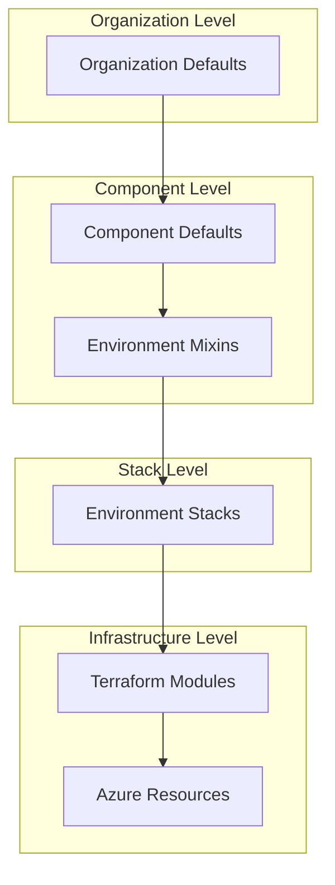
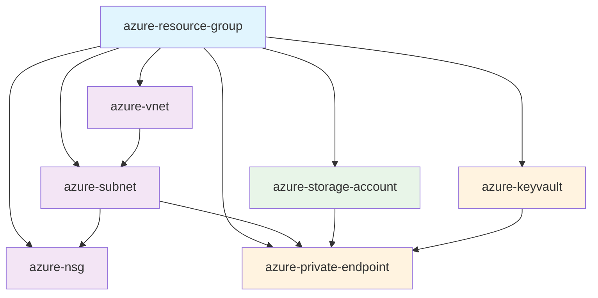
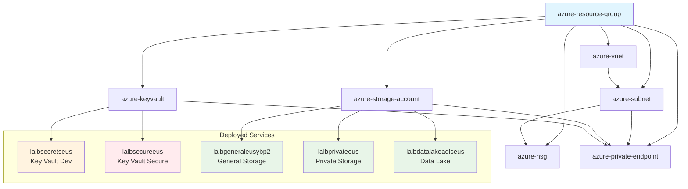
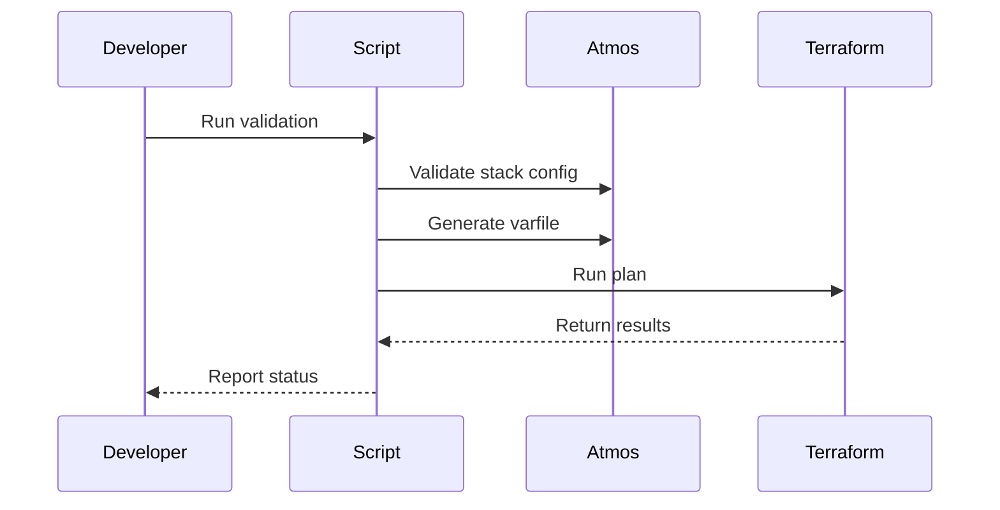

# One Platform Architecture

This document provides a comprehensive overview of the One Platform architecture, design principles, and component relationships.

## 🏗️ Architecture Overview

One Platform follows a hierarchical, component-based architecture using Atmos for orchestration and Terraform for infrastructure provisioning.



## 📁 Directory Structure

```
one-platform/
├── atmos/                           # Atmos workspace
│   ├── atmos.yaml                   # Atmos configuration
│   ├── components/                  # Terraform components
│   │   └── terraform/modules/       # Reusable modules
│   │       ├── azure-resource-group/
│   │       ├── azure-vnet/
│   │       ├── azure-subnet/
│   │       ├── azure-nsg/
│   │       ├── azure-private-endpoint/
│   │       ├── azure-storage-account/
│   │       └── azure-keyvault/
│   └── stacks/                      # Stack configurations
│       ├── catalog/                 # Component defaults & mixins
│       │   ├── azure-rsg/
│       │   ├── azure-vnet/
│       │   ├── azure-subnet/
│       │   ├── azure-nsg/
│       │   ├── azure-private-endpoint/
│       │   ├── azure-storage-account/
│       │   └── azure-keyvault/
│       ├── orgs/                    # Organization defaults
│       │   └── lazylabs/
│       └── azure/                   # Environment stacks
│           └── dev/
├── scripts/                         # Validation & utility scripts
├── docs/                           # Documentation
└── .github/                        # GitHub templates & workflows
```

## 🧩 Component Architecture

### Component Types

1. **Foundation Components**
   - `azure-resource-group`: Base container for all resources
   - `azure-vnet`: Network foundation
   - `azure-subnet`: Network segmentation

2. **Network Components**
   - `azure-nsg`: Network security groups and rules
   - `azure-private-endpoint`: Secure connectivity

3. **Service Components**
   - `azure-storage-account`: Storage services (V2, ADLS Gen2)
   - `azure-keyvault`: Key and secrets management

4. **Future Components**
   - SQL Database, Container Services, etc.

### Component Relationships



### Component Design Patterns

#### 1. Standard Module Structure
```
azure-component/
├── main.tf              # Primary resource definitions
├── variables.tf         # Input variables with descriptions
├── outputs.tf           # Output values for other components
├── providers.tf         # Provider requirements
├── backend.tf.json      # Backend configuration (generated)
├── providers_override.tf.json  # Provider overrides (generated)
└── README.md           # Usage documentation
```

#### 2. Conditional Resource Creation
```hcl
resource "azurerm_resource" "this" {
  count = var.enabled ? 1 : 0
  # Configuration
}
```

#### 3. Consistent Naming
```hcl
module "label" {
  source  = "cloudposse/label/null"
  version = "0.25.0"
  
  namespace   = var.namespace
  environment = var.environment
  stage       = var.stage
  name        = var.name
  # Additional configuration
}
```

## 🏷️ Naming Convention

### Resource Naming Pattern
`{environment}{stage}{name}{namespace}`

### Examples
| Component | Environment | Stage | Name | Namespace | Result |
|-----------|-------------|-------|------|-----------|--------|
| Resource Group | eus | dev | services | lazylabs | eusdevserviceslazylabs |
| Virtual Network | eus | dev | network | lazylabs | eusdevnetworklazylabs |
| Subnet | eus | dev | web | lazylabs | eusdevweblazylabs |

### Naming Benefits
- **Consistency**: Predictable resource names
- **Environment Clarity**: Clear environment identification
- **Uniqueness**: Globally unique resource names
- **Brevity**: Shorter than previous convention

## 📋 Stack Configuration Architecture

### Configuration Hierarchy

1. **Organization Defaults** (`orgs/lazylabs/_defaults.yaml`)
   - Global settings for the organization
   - Backend configuration
   - Provider settings
   - Base naming configuration

2. **Component Defaults** (`catalog/{component}/defaults.yaml`)
   - Component-specific defaults
   - Metadata configuration
   - Standard variable values

3. **Environment Mixins** (`catalog/{component}/mixins/{env}.yaml`)
   - Environment-specific overrides
   - Development vs production differences
   - Security settings per environment

4. **Stack Configuration** (`azure/{env}/{env}.yaml`)
   - Final component configuration
   - Component-specific values
   - Inter-component dependencies

### Configuration Inheritance

```yaml
# Organization defaults
vars:
  namespace: "lazylabs"
  tenant: "core"
  delimiter: ""
  label_order: [environment, stage, name, namespace]

# Component defaults (inherited)
vars:
  enabled: true
  regex_replace_chars: "/[^a-zA-Z0-9]/"

# Environment mixins (inherited + overrides)
vars:
  private_endpoint_network_policies: "Enabled"

# Stack configuration (final values)
vars:
  name: "web"
  address_prefixes: ["10.0.1.0/24"]
```

## 🔗 Component Dependencies

### Dependency Management
Components reference each other using Atmos interpolation:

```yaml
# Subnet references VNet and Resource Group
resource_group_name: "${var.environment}${var.stage}${components.terraform.azure-resource-group.vars.name}${var.namespace}"
virtual_network_name: "${var.environment}${var.stage}${components.terraform.azure-vnet.vars.name}${var.namespace}"
```

### Dependency Graph


## 🔧 Validation Architecture

### Multi-Level Validation

1. **Stack Configuration Validation**
   ```bash
   atmos validate stacks
   ```

2. **Component-Level Validation**
   ```bash
   ./scripts/validate-component.sh azure-subnet core-eus-dev
   ```

3. **Full Platform Validation**
   ```bash
   ./scripts/validate-all-stacks.sh
   ```

### Validation Flow


## 🚀 Deployment Architecture

### Backend Configuration
```yaml
terraform:
  backend_type: azurerm
  backend:
    azurerm:
      resource_group_name: "atmos-rsg-core"
      storage_account_name: "statomicore"
      container_name: "corestate"
```

### State Management
- **Centralized State**: Azure Storage Account
- **State Isolation**: Separate state per component per environment
- **Locking**: Automatic state locking via Azure Storage
- **Versioning**: State file versioning enabled

## 🔒 Security Architecture

### Network Security
- **Private Endpoints**: Secure connectivity to Azure services
- **Network Policies**: Controlled network access
- **Subnet Isolation**: Segmented network architecture

### Access Control
- **Azure RBAC**: Role-based access control
- **Service Principals**: Automated deployment accounts
- **Just-in-Time Access**: Temporary access elevation

### Secret Management
- **No Hardcoded Secrets**: All secrets externalized
- **Environment Variables**: Runtime secret injection
- **Azure Key Vault**: Centralized secret storage

#### Key Vault Security Patterns

1. **Development Key Vault** (`azure-keyvault-dev`)
   ```yaml
   public_network_access_enabled: true
   network_acls:
     default_action: "Allow"
     bypass: "AzureServices"
   ```
   - Public access for development convenience
   - Development secrets and connection strings
   - Standard access policies

2. **Secure Key Vault** (`azure-keyvault-secure`)
   ```yaml
   public_network_access_enabled: false
   network_acls:
     default_action: "Deny"
     bypass: "AzureServices"
   ```
   - Private endpoint access only
   - Production secrets and encryption keys
   - Enhanced security with purge protection

#### Private Endpoint Security
- **Network Isolation**: VNet-only access via 10.0.1.0/24 subnet
- **DNS Integration**: Private DNS zones for service resolution
- **Service Endpoints**: Vault, blob, dfs, file, table services
- **Access Control**: Service principal authentication with explicit permissions

## 🚀 Current Deployment Status

### Infrastructure Overview
The One Platform currently has a fully operational development environment deployed in Azure East US region with the following architecture:

```
Azure Subscription: fa626e61-2056-42b0-847a-1aad6fa3b5dd
└── Resource Group: lalb-services-eus
    ├── 🌐 Networking
    │   ├── Virtual Network: lalbnetworkeus (10.0.0.0/16)
    │   ├── Subnet: lalbeusdevweb (10.0.1.0/24)
    │   └── Network Security Group: lalbwebeus
    │
    ├── 💾 Storage Services
    │   ├── General Storage: lalbgeneraleusybp2 (Standard V2)
    │   ├── Private Storage: lalbprivateeus (with private endpoint)
    │   └── Data Lake: lalbdatalakeadlseus (ADLS Gen2)
    │
    ├── 🔐 Security Services
    │   ├── Dev Key Vault: lalbsecretseus (public access)
    │   └── Secure Key Vault: lalbsecureeus (private access only)
    │
    └── 🔗 Private Endpoints
        ├── Storage Blob: lalbstgblob + lalbdlblob + lalbdldfs
        └── Key Vault: lalbkvsecureeus
```

### Deployment Validation
All components have been successfully deployed and validated:
- ✅ Core networking infrastructure operational
- ✅ Storage accounts with private endpoint connectivity
- ✅ Key Vault services with dual security models
- ✅ Private endpoint network isolation
- ✅ Service principal access policies configured

### Component Status Summary
| Component | Instance | Status | Access Method |
|-----------|----------|--------|---------------|
| Resource Group | lalb-services-eus | ✅ Active | Azure Portal |
| Virtual Network | lalbnetworkeus | ✅ Active | 10.0.0.0/16 |
| Subnet | lalbeusdevweb | ✅ Active | 10.0.1.0/24 |
| NSG | lalbwebeus | ✅ Active | Subnet attached |
| General Storage | lalbgeneraleusybp2 | ✅ Active | Public endpoint |
| Private Storage | lalbprivateeus | ✅ Active | Private endpoint |
| Data Lake | lalbdatalakeadlseus | ✅ Active | Private endpoint |
| Dev Key Vault | lalbsecretseus | ✅ Active | Public endpoint |
| Secure Key Vault | lalbsecureeus | ✅ Active | Private endpoint only |

## 📈 Scalability Architecture

### Horizontal Scaling
- **Multiple Instances**: Same component, different configurations
- **Environment Separation**: Isolated environments
- **Region Distribution**: Multi-region deployments

### Vertical Scaling
- **Component Modularity**: Add new components as needed
- **Configuration Flexibility**: Adapt to changing requirements
- **Inheritance**: Efficient configuration management

## 🔄 CI/CD Architecture

### Automated Workflows
1. **Semantic Versioning**: Automated tagging on PR merge
2. **Pull Request Validation**: Automated testing
3. **Security Scanning**: Code and configuration analysis

### Workflow Triggers
- **Pull Request**: Validation and testing
- **Merge to Main**: Version tagging
- **Manual**: On-demand deployments

## 🎯 Design Principles

### 1. Modularity
- Self-contained components
- Clear interfaces and dependencies
- Reusable across environments

### 2. Consistency
- Standardized naming conventions
- Common configuration patterns
- Unified documentation

### 3. Flexibility
- Environment-specific configurations
- Multiple instance support
- Extensible architecture

### 4. Security
- Private connectivity by default
- Minimal permissions
- Audit and compliance ready

### 5. Maintainability
- Clear documentation
- Automated validation
- Version control

## 🔮 Future Architecture Considerations

### Planned Enhancements
1. **Multi-Cloud Support**: Extend beyond Azure
2. **Advanced Networking**: Hub-spoke architectures
3. **Monitoring Integration**: Observability components
4. **Cost Management**: Resource optimization
5. **Compliance**: Policy as code

### Extensibility Points
- New Azure service components
- Additional cloud providers
- Custom business logic
- Integration with external systems